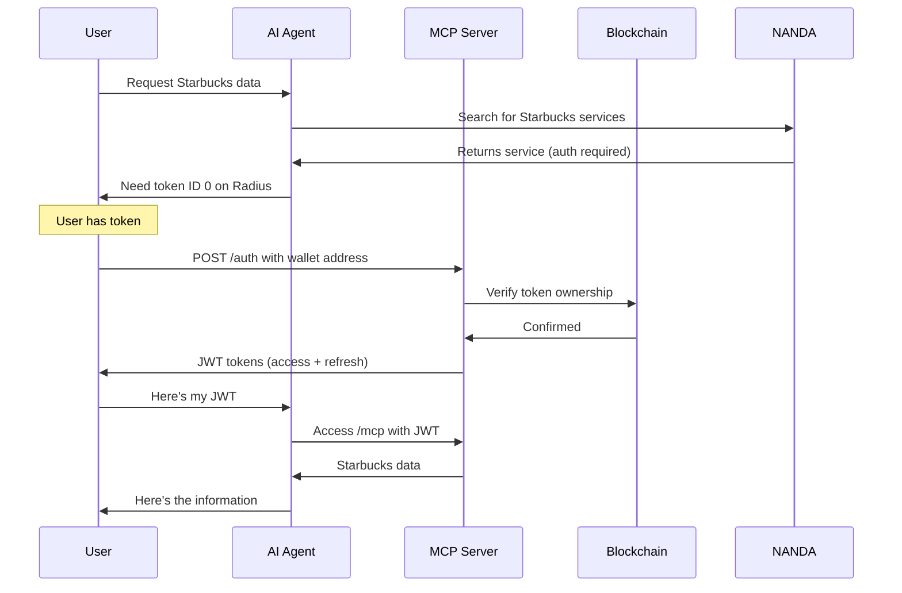

# NANDA Registry Integration Guide

This guide explains how to register your EVMAuth-protected MCP server with the NANDA registry and how AI agents interact with token-gated services.

## Table of Contents
1. [Overview](#overview)
2. [Prerequisites](#prerequisites)
3. [Registration Process](#registration-process)
4. [Authentication Flow](#authentication-flow)
5. [AI Agent Discovery](#ai-agent-discovery)
6. [Testing Your Integration](#testing-your-integration)
7. [Troubleshooting](#troubleshooting)

## Overview

NANDA (Networked Agents and Decentralized AI) is a registry that enables AI agents to discover and interact with MCP servers. Our server adds EVMAuth token-gating, creating a premium access model for AI services.

### What Makes Our Integration Special
- **Token-Gated Access**: Only users with specific blockchain tokens can access the service
- **Decentralized Authentication**: No centralized API keys or subscriptions
- **AI-Ready**: Designed for seamless AI agent integration
- **Transparent Pricing**: Token ownership = access rights

## Prerequisites

Before registering with NANDA:

1. **Deploy Your Server**
   - Server must be publicly accessible (e.g., Railway, Heroku, AWS)
   - Ensure all endpoints are working:
     - `/` - Basic info
     - `/health` - Health check
     - `/auth` - Authentication endpoint
     - `/mcp` - MCP protocol endpoint
     - `/metadata/*` - NANDA metadata endpoints

2. **Verify Token Configuration**
   - EVMAuth contract deployed on Radius blockchain
   - Token ID configured correctly
   - Test wallet with token for verification

3. **Prepare Registration Information**
   - Server name and description
   - Public URL
   - Authentication requirements
   - Available tools and categories

## Registration Process

### Step 1: Access NANDA Registry
Navigate to [https://ui.nanda-registry.com/](https://ui.nanda-registry.com/)

### Step 2: Prepare Your Metadata

Get your server metadata by visiting:
```
https://your-server.com/metadata/nanda?format=markdown
```

This will give you formatted information ready for submission.

### Step 3: Submit Your Service

1. Click "Register New Service" (or similar button)
2. Fill in the registration form with:

```yaml
Service Name: Starbucks Premium MCP Server
Description: Token-gated access to comprehensive Starbucks company information
Protocol: MCP
Endpoint: https://your-server.com/mcp

Authentication:
  Type: EVMAuth
  Required: Yes
  Blockchain: Radius
  Contract: 0x5448Dc20ad9e0cDb5Dd0db25e814545d1aa08D96
  Token ID: 0
  
Tools:
  - requestinfo: Get company information by category

Categories:
  - company-data
  - premium
  - token-gated
  - food-beverage
  
Tags:
  - evmauth
  - blockchain
  - radius
  - starbucks
  - enterprise
```

### Step 4: Verify Registration

After submission:
1. Search for your service in the NANDA registry
2. Check that all metadata is displayed correctly
3. Test the discovery flow

## Authentication Flow

### How EVMAuth + JWT Works



### Authentication Endpoints

#### 1. Get JWT Token
```bash
POST /auth
Content-Type: application/json

{
  "address": "0x3BE5BcE56D46D04e3E1351616A0bDdBBDa240e69"
}

Response:
{
  "accessToken": "eyJhbGc...",
  "refreshToken": "eyJhbGc...",
  "expiresIn": 900
}
```

#### 2. Refresh Token
```bash
POST /auth/refresh
Content-Type: application/json

{
  "refreshToken": "eyJhbGc..."
}

Response:
{
  "accessToken": "eyJhbGc...",
  "expiresIn": 900
}
```

#### 3. Access MCP Endpoint
```bash
POST /mcp
Authorization: Bearer eyJhbGc...
Content-Type: application/json

{
  "jsonrpc": "2.0",
  "method": "tools/call",
  "params": {
    "name": "requestinfo",
    "arguments": {
      "category": "overview"
    }
  },
  "id": 1
}
```

## AI Agent Discovery

### How AI Agents Find Your Service

1. **Agent searches NANDA**: "Get Starbucks company data"
2. **NANDA returns matches**: Including your token-gated service
3. **Agent checks requirements**: Sees EVMAuth token needed
4. **Agent prompts user**: "This requires token ID 0 on Radius blockchain"
5. **If user has token**: Agent handles auth flow automatically
6. **If no token**: Agent provides acquisition instructions

### Discovery Metadata

AI agents can query your discovery endpoint:

```bash
GET /metadata/discovery

Response:
{
  "service": {
    "name": "Starbucks Premium MCP Server",
    "endpoint": "https://your-server.com/mcp",
    "requiresAuth": true
  },
  "authentication": {
    "instructions": "This service requires EVMAuth token ownership...",
    "tokenInfo": {
      "blockchain": "radius",
      "contract": "0x5448Dc20ad9e0cDb5Dd0db25e814545d1aa08D96",
      "tokenId": "0"
    }
  }
}
```

### MCP Client Configuration

For manual configuration, AI users can add to their MCP client:

```json
{
  "mcpServers": {
    "starbucks-premium": {
      "command": "curl",
      "args": ["-X", "POST", "https://your-server.com/mcp"],
      "env": {
        "AUTH_TOKEN": "${JWT_TOKEN}"
      }
    }
  }
}
```

## Testing Your Integration

### 1. Test Discovery
```bash
# Check your metadata endpoints
curl https://your-server.com/metadata
curl https://your-server.com/metadata/discovery
curl https://your-server.com/metadata/nanda
```

### 2. Test Authentication
```bash
# Get JWT (replace with your wallet address)
curl -X POST https://your-server.com/auth \
  -H "Content-Type: application/json" \
  -d '{"address": "0x3BE5BcE56D46D04e3E1351616A0bDdBBDa240e69"}'
```

### 3. Test MCP Access
Use the demo script:
```bash
node demo-nanda-discovery.cjs
```

### 4. Verify NANDA Listing
- Search for your service on ui.nanda-registry.com
- Check all metadata is correct
- Test the "Connect" or "Use" button

## Troubleshooting

### Common Issues

#### "Service not found in NANDA"
- Ensure registration was completed
- Check service name spelling
- Wait for registry to update (may take a few minutes)

#### "Authentication failed"
- Verify wallet owns the required token
- Check token ID and contract address
- Ensure JWT hasn't expired (15 min lifetime)

#### "Cannot connect to MCP endpoint"
- Verify server is publicly accessible
- Check CORS configuration
- Ensure /mcp endpoint requires authentication

#### "Token verification failed"
- Check Radius RPC connection
- Verify EVMAuth contract address
- Ensure wallet has token ID 0

### Debug Commands

```bash
# Check token balance
node check-token-balance.cjs

# Test full auth flow
node test-auth-flow.js

# Run security tests
node test-security.js
```

### Getting Help

1. **Server Issues**: Check logs with proper filtering
2. **Token Issues**: Verify on Radius blockchain explorer
3. **NANDA Issues**: Contact NANDA support
4. **Integration Help**: See our GitHub issues

## Best Practices

1. **Keep Metadata Updated**: When you change tools or authentication
2. **Monitor Usage**: Track which AI agents access your service
3. **Handle Errors Gracefully**: Provide clear messages for token requirements
4. **Document Changes**: Update NANDA listing when modifying service
5. **Test Regularly**: Ensure authentication flow works smoothly

## Next Steps

1. ✅ Register your service on NANDA
2. ✅ Test with AI agents
3. 📊 Monitor usage and adoption
4. 🚀 Expand to multi-tier access (different tokens = different features)
5. 🤝 Connect with other NANDA services

---

Your token-gated MCP server is now part of the decentralized AI ecosystem! 🎉