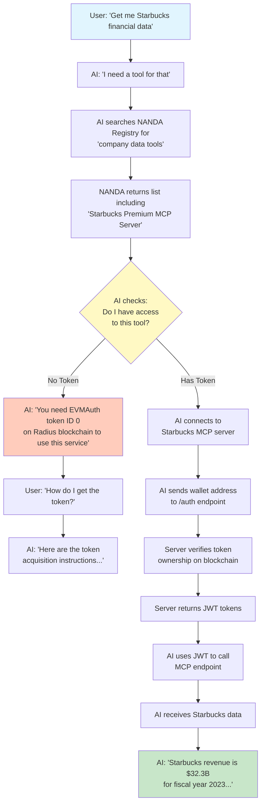

# NANDA Token-Gated Service Flow

## Visual Flow Diagram



## Detailed Flow Steps

### 1. User Request
User asks AI agent: "Get me Starbucks financial data"

### 2. AI Tool Discovery
AI recognizes it needs a specialized tool and searches NANDA registry for "company data" services

### 3. NANDA Registry Response
NANDA returns a list of available MCP servers, including our "Starbucks Premium MCP Server" with metadata showing it requires authentication

### 4. Access Check
AI checks if the user has the required EVMAuth token (Token ID: 0 on Radius blockchain)

### 5A. No Token Path
- AI informs user they need the token
- Provides acquisition instructions
- Cannot proceed without token

### 5B. Has Token Path
- AI proceeds with authentication
- Sends user's wallet address to /auth
- Server verifies on-chain ownership
- Receives JWT tokens
- Uses JWT to access MCP endpoint
- Retrieves and returns data to user

## Key Components

```mermaid
graph LR
    subgraph "NANDA Ecosystem"
        N[NANDA Registry]
        M[MCP Servers]
    end
    
    subgraph "Blockchain"
        B[Radius Chain]
        E[EVMAuth Contract]
        T[Token ID: 0]
    end
    
    subgraph "Our Server"
        S[Starbucks MCP]
        A[/auth endpoint]
        MC[/mcp endpoint]
    end
    
    subgraph "AI Agent"
        AI[Claude/GPT/etc]
        W[User's Wallet]
    end
    
    AI --> N
    N --> AI
    AI --> S
    W --> B
    B --> S
    S --> AI
```

## What Makes This Special

1. **Decentralized Access**: No API keys, just token ownership
2. **Premium Content**: Token = access to high-value data
3. **AI-Native**: Designed for AI agents to discover and use
4. **Blockchain Verified**: Every access is cryptographically verified
5. **Standard Protocols**: Uses MCP and JWT standards

This flow demonstrates the future of AI services where blockchain tokens gate access to premium tools and data.